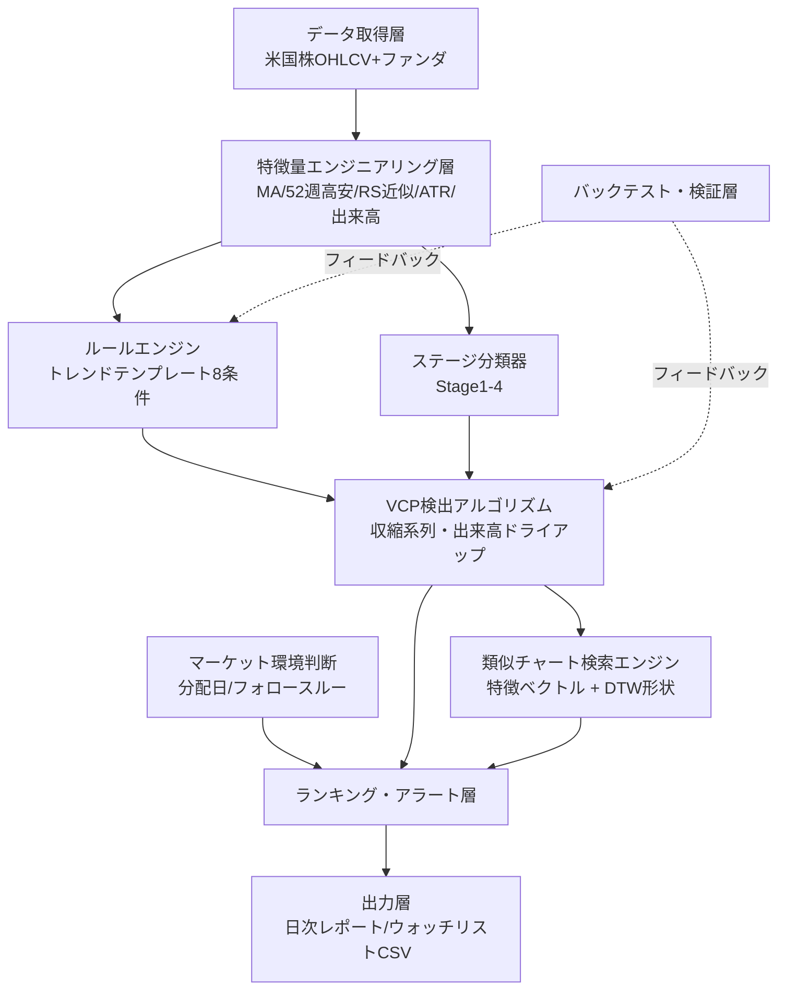

# ミネルヴィニ流チャート分析 自動化システム設計書
最終更新: 2026-07-29 / 対象市場: 米国株 / 実装フェーズ: 未着手(設計のみ)

前提資料: [01_ミネルヴィニ投資手法_調査レポート.md](01_ミネルヴィニ投資手法_調査レポート.md)、[マーケット分析/01_マーケット環境判断フレームワーク.md](../マーケット分析/01_マーケット環境判断フレームワーク.md)

## 0. システムのゴール

米国株全銘柄(~8,000銘柄規模)を対象に、以下2つを日次で自動実行する。

- **(A) スクリーニング**: トレンドテンプレート8条件 + VCPパターンを満たす「今買い場が近い/来ている」銘柄を抽出・ランキング
- **(B) 類似チャート発掘**: ユーザーが指定した参照銘柄(過去の成功例や気になる銘柄)のチャート形状に似ている銘柄を、全ユニバースから検索

(A)は「ルールに合格する銘柄を探す」網羅的スクリーニング、(B)は「この形に似ているものを探す」類似検索であり、アルゴリズムの性質が異なるため設計上明確に分離する。

---

## 1. 全体アーキテクチャ

---

## 2. データ取得層

### 2.1 必要データ
- 米国上場銘柄(NYSE/NASDAQ/AMEX)の**日次OHLCV**(最低2年、理想は5年超の履歴。52週高安・200日線・ステージ判定に必要)
- コーポレートアクション調整済み(株式分割・配当調整)
- 上場廃止・買収された銘柄も含む履歴(バックテスト時のサバイバーシップバイアス回避のため)
- (将来拡張)ファンダメンタルズ: EPS成長率、売上成長率 — 今回はスコープ外だが、データ取得層はこれを後付けできる形にしておく

### 2.2 ユニバース定義(初期フィルタ)
- 取引所: NYSE, NASDAQ, NYSE American。OTC/ピンクシートは除外
- 株価: $5〜10以上(低位株のノイズ・出来高偽装リスクを避ける)
- 平均出来高ドル建て(過去50日): $1,000万以上を目安(流動性フィルタ。ミネルヴィニも薄商い銘柄を嫌う)
- ETF・優先株・ワラント・ADRの扱いは別カテゴリとして除外 or 別ユニバース管理

### 2.3 データベンダー比較

| ベンダー | カバレッジ | 強み | 弱み | 想定コスト感 |
|---|---|---|---|---|
| **Tiingo** | 米国株中心、30年超の履歴 | 分割/配当調整が丁寧、学術/個人向けに安価 | 銘柄横断の一括ファンダメンタルズはやや弱い | 個人利用なら低コスト〜無料枠あり |
| **EODHD** | 150,000銘柄超、70取引所 | ファンダメンタルズ込み、一括ダウンロードAPIあり、コスパ良好 | データ品質は銘柄によりムラの指摘あり | 月額$20程度〜 |
| **Polygon.io(現Massive)** | 米国全取引所、2003年〜 | リアルタイム/低レイテンシ、板情報まで対応 | 日次バッチ用途にはオーバースペック・やや高価 | 用途により幅広い価格帯 |

**推奨**: 初期構築は**Tiingo(価格データ)+ EODHD(ファンダ拡張用)**の組み合わせでコストを抑えつつ開始し、リアルタイム性が必要になった段階でPolygonへの切替/併用を検討。

### 2.4 更新頻度
- 日次(米国市場引け後、日本時間の早朝)にバッチ取得 → 特徴量再計算 → レポート生成、を1パイプラインとして設計

---

## 3. 特徴量エンジニアリング層

| 特徴量 | 計算方法 | 用途 |
|---|---|---|
| SMA50 / SMA150 / SMA200 | 単純移動平均 | トレンドテンプレート、ステージ判定 |
| 52週高値・安値 | 直近252営業日のローリング最大・最小 | トレンドテンプレート条件6・7 |
| RSレーティング近似値 | `0.4×3ヶ月騰落率 + 0.2×6ヶ月 + 0.2×9ヶ月 + 0.2×12ヶ月` をユニバース内でパーセンタイル化(1-99) | トレンドテンプレート条件8 |
| ATR(14) | Average True Range | VCP収縮幅の正規化、ボラティリティ比較 |
| ADR% | 過去20日の高安レンジ平均を価格比%化 | 銘柄の値動きの荒さの把握、ストップ幅設計 |
| 出来高移動平均(50日) | 出来高SMA | VCP出来高ドライアップ判定、ブレイク時出来高急増判定 |
| MA傾き(200日の1ヶ月変化率) | SMA200の21営業日前との差分 | ステージ分類 |

---

## 4. ルールエンジン(トレンドテンプレート・一次フィルタ)

調査レポート「5. スクリーニング・ロジックへの落とし込み」の表をそのままハードフィルタとして実装する。8条件をすべて満たす銘柄のみが次段階(ステージ精査・VCP検出)に進む。この段階で全ユニバース(~8,000)から数百銘柄程度まで絞り込めることが期待値。

**実装上の注意**
- 条件は全てAND条件。一部だけ緩めた「準合格リスト」も別枠で保持しておくと、ブレイク直前の監視銘柄を見逃さずに済む
- RS近似式はIBD公式値と厳密には一致しない前提を運用ルールに明記し、閾値(70)は自ユニバースでの再キャリブレーションを推奨

---

## 5. ステージ分類器

ルールベースで実装可能なヒューリスティック例:

1. **Stage 2判定**: トレンドテンプレート8条件を満たす → Stage 2候補
2. **Stage 1判定**: 200日線の傾きがほぼ横ばい(直近1ヶ月変化率が±2%以内)、価格が200日線付近でレンジ、出来高が過去平均以下 → Stage 1(監視リスト)
3. **Stage 3判定**: 直近でトレンドテンプレートを満たしていたが、50日線が150日線を割り込む、または200日線の傾きが鈍化(直近1ヶ月変化率がプラスから縮小) → Stage 3(利益確定検討/新規除外)
4. **Stage 4判定**: 価格が200日線を明確に下回り、200日線が下向き → Stage 4(対象外)

ステージはあくまで「4分類の近似」であり、境界は曖昧になりうる。将来的には教師データ(過去の確定ステージのラベル)を作り、機械学習分類器(勾配ブースティング等)への置き換えも視野に入れる。

---

## 6. VCP検出アルゴリズム

本手法の核心かつ最難関部分。以下のパイプラインを提案する。

### 6.1 スイングポイント検出
- ZigZag法(一定%以上の反転を基準に高値・安値を抽出)またはフラクタル法(N本前後より高い/低い足を極値とする)で、直近base候補期間(例: 直近3〜6ヶ月)のスイングハイ・スイングローを抽出

### 6.2 収縮(Contraction)の測定
- 連続するスイングハイ→スイングローのペアを「押し」とみなし、各押しの下落率(%)を算出
- 押しを時系列順に並べ、下落率が**単調減少に近い系列**になっているかを評価(完全な単調減少でなくてもよいが、直近の押しほど浅くなっている傾向をスコア化)
- 押しの回数(2〜6回程度が正常域)、base全体の期間(数週間〜数ヶ月)も評価軸に含める

### 6.3 出来高ドライアップの評価
- 各押しの期間中の平均出来高を50日出来高平均と比較し、押しが進むごとに出来高が減少しているかを確認
- 直近の押し(ピボット直前)の出来高が最も少ない状態が理想

### 6.4 タイト化(値幅収縮)の評価
- 直近5〜10営業日のATR、または日々の高安レンジ%が、base開始時点と比べて縮小しているかを確認

### 6.5 ピボットポイントの特定とブレイク判定
- base内の直近スイングハイを「ピボットポイント」として登録
- 当日終値がピボットポイントを上抜け、かつ出来高が50日平均比+40〜50%以上 → ブレイクシグナル発火

### 6.6 VCPスコア化
上記4要素(収縮の単調性、押しの回数、出来高ドライアップ度、値幅タイト化度)を重み付け合成し、0〜100のVCPスコアとして出力する。閾値以上をVCP成立候補、ブレイク条件も満たしたものを「本日の買いシグナル」として最上位に表示する。

> **留意点**: VCPはミネルヴィニ自身の著書でも「厳密な数式」ではなく経験則・パターン認識として説明されている。ルールベースのスコアは有効なスクリーニングの一次選抜として機能するが、最終判断は人間によるチャート目視確認を残すハイブリッド運用を推奨する。

---

## 7. 類似チャート検索エンジン

「(B)類似チャート発掘」を実現する層。2方式を併用する設計とする。

### 7.1 特徴ベクトル方式(構造的類似度)
- 各銘柄の直近N日(例: 60〜120営業日)について、以下を正規化した特徴ベクトルを構築:
  - トレンドテンプレート各条件の充足度(0/1またはマージン%)
  - RS近似順位
  - VCPスコアおよびその内訳(収縮回数・出来高ドライアップ度・タイト化度)
  - 出来高プロファイル(base期間平均出来高/直近出来高比)
- 参照銘柄(ユーザー指定 or 過去の成功事例ライブラリ)とのコサイン類似度、またはkNN(scikit-learn / faissによる近似最近傍探索)でランキング
- 用途: 「数値的な特徴が似ている」銘柄を高速に大量スクリーニングする

### 7.2 形状ベース方式(視覚的類似度)
- 価格系列を対数リターン化 or Min-Maxスケーリングし、長さの異なる期間同士でも比較可能にする
- **DTW(Dynamic Time Warping)** を用いて、時間軸の伸縮を許容しながら「見た目のカーブの形」が似ている区間を検索(`dtaidistance`、`tslearn`等のライブラリで実装可能)
- 用途: 「このチャートの形にそっくり」という直感的な類似性を定量評価する。ミネルヴィニ自身も過去の成功パターンとの視覚的類似性を重視するため、この方式は手法の思想と親和性が高い

### 7.3 参照ライブラリの構築
- 過去の実際のミネルヴィニ的成功銘柄(ブレイク前のVCP形成期間のチャート)を「お手本」としてライブラリ化し、日々のスクリーニング結果をこのライブラリとの類似度でランキングする運用を想定
- ライブラリは自身の取引記録やスクリーニング結果の蓄積から徐々に拡充していく設計とする(最初は数銘柄からで良い)

---

## 8. マクロゲート連携

[マーケット分析/01_マーケット環境判断フレームワーク.md](../マーケット分析/01_マーケット環境判断フレームワーク.md)で定義した「強気/警戒/弱気」の3区分を、日次バッチの最初に計算し、後段のランキング・アラート層に受け渡す。警戒・弱気時は個別銘柄スコアを減点、または新規推奨から除外して監視リストへ格下げする。

---

## 9. バックテスト・検証層

- 過去N年分のデータに対しスクリーニングロジックを再実行し、シグナル発生日を特定
- シグナル後の1週間・1ヶ月・3ヶ月リターン分布を算出し、ベンチマーク(S&P500)と比較
- ヒット率(一定%以上上昇した割合)、平均リターン、最大ドローダウンを評価指標とする
- サバイバーシップバイアス回避のため、上場廃止銘柄も含めたユニバースでバックテストすることが必須
- VCPスコアやトレンドテンプレート閾値のチューニングはこの層の結果に基づいて行う(カーブフィッティングに注意し、in-sample/out-of-sampleを分けて検証)

---

## 10. 出力層

- 日次Markdown/HTMLレポート: 本日の新規シグナル銘柄、VCPスコア上位銘柄、類似検索結果、マーケット環境サマリー
- ウォッチリストCSV出力(証券会社のウォッチリスト機能へのインポート用)
- 将来拡張: Streamlit等による簡易ダッシュボード化、チャート画像の自動生成・貼付

---

## 11. 技術スタック推奨

| 領域 | 推奨技術 |
|---|---|
| 言語 | Python |
| データ処理 | pandas, numpy, pandas-ta(テクニカル指標) |
| DTW計算 | dtaidistance または tslearn |
| 類似検索(kNN) | scikit-learn(小規模)、faiss(大規模・高速化時) |
| ストレージ | Parquet ファイル または DuckDB(軽量・分析向けSQL) |
| スケジューリング | cron / Windowsタスクスケジューラ |
| レポート出力 | Jinja2 + Markdown、将来的にStreamlit |

---

## 12. フェーズ別ロードマップ

| フェーズ | 内容 | 成果物イメージ |
|---|---|---|
| Phase 1 | データ取得パイプライン + トレンドテンプレート8条件スクリーナー | 日次で条件合格銘柄リストが出力される |
| Phase 2 | VCP検出アルゴリズム実装・スコア化 | スクリーニング結果にVCPスコア・ピボット価格が付与される |
| Phase 3 | 類似チャート検索エンジン(特徴ベクトル→DTW形状の順で拡張) | 参照銘柄を指定すると類似銘柄リストが得られる |
| Phase 4 | バックテスト・検証フレームワーク | 過去データでの有効性レポート、閾値チューニング |
| Phase 5 | マクロゲート統合・自動レポート配信・アラート化 | 完全自動化された日次ワークフロー |

---

## 13. 既知の限界・留意点

- **RSレーティング近似式の精度**: IBD公式値とは一致しない可能性があり、閾値(70)は自前ユニバースでの再キャリブレーションが必要
- **VCPの主観性**: 定性的パターンであり、完全なルール化には限界がある。スコアリングはあくまで一次選抜であり、最終的な目視確認を組み込むハイブリッド運用を推奨
- **データコスト**: 全米国株×数年分のデータ・ファンダメンタルズ込みで運用する場合、月額数千円〜数万円規模のデータ費用が発生しうる
- **カーブフィッティングリスク**: VCP閾値や類似度閾値をバックテスト結果に過度に最適化すると、将来のパフォーマンスが劣化するリスクがある。out-of-sample検証を必須とする
- **サバイバーシップバイアス**: 上場廃止銘柄を含まないデータでバックテストすると成績が過大評価されるため注意

---

## 14. 参考情報源

- [ksred.com: Financial Data APIs Compared](https://www.ksred.com/the-complete-guide-to-financial-data-apis-building-your-own-stock-market-data-pipeline-in-2025/)
- [EODHD: Historical Prices API](https://eodhd.com/lp/historical-eod-api)
- [KDB.AI: Temporal Search with Dynamic Time Warping](https://docs.kx.com/1.7/KDB_AI/Learn/dynamic-time-warping.htm)
- [Medium: Pattern Mining for Stock Prediction with Dynamic Time Warping](https://medium.com/@crisvelasquez/pattern-mining-for-stock-prediction-with-dynamic-time-warping-3f8df5fb4c5b)
- [arXiv: Temporal Representation Learning for Stock Similarities](https://arxiv.org/pdf/2407.13751)
